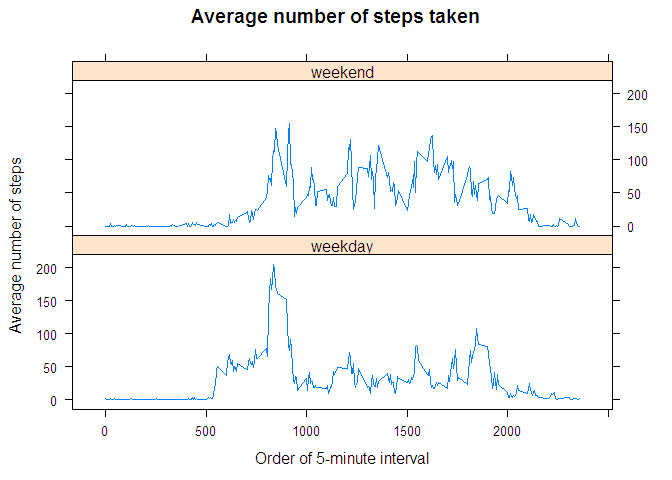

# Reproducible Research: Peer Assessment 1


## Loading and preprocessing the data

```r
library(plyr)
library(timeDate)
library(lattice)
```

```r
data.zip <- "activity.zip"
data.file <- "activity.csv"
data <- read.csv(unz(data.zip, data.file))
head(data)
```

```
##   steps       date interval
## 1    NA 2012-10-01        0
## 2    NA 2012-10-01        5
## 3    NA 2012-10-01       10
## 4    NA 2012-10-01       15
## 5    NA 2012-10-01       20
## 6    NA 2012-10-01       25
```

```r
tail(data)
```

```
##       steps       date interval
## 17563    NA 2012-11-30     2330
## 17564    NA 2012-11-30     2335
## 17565    NA 2012-11-30     2340
## 17566    NA 2012-11-30     2345
## 17567    NA 2012-11-30     2350
## 17568    NA 2012-11-30     2355
```


## What is mean total number of steps taken per day?
### 1. Calculate the total number of steps taken per day

```r
# remove NAs
clean.steps.data <- data[!is.na(data$steps),]
day.steps.data <- aggregate(steps ~ date, 
                            data = clean.steps.data,
                            sum)
head(day.steps.data)
```

```
##         date steps
## 1 2012-10-02   126
## 2 2012-10-03 11352
## 3 2012-10-04 12116
## 4 2012-10-05 13294
## 5 2012-10-06 15420
## 6 2012-10-07 11015
```

```r
tail(day.steps.data)
```

```
##          date steps
## 48 2012-11-24 14478
## 49 2012-11-25 11834
## 50 2012-11-26 11162
## 51 2012-11-27 13646
## 52 2012-11-28 10183
## 53 2012-11-29  7047
```

### 2. Make a histogram of the total number of steps taken each day

```r
# get mean and median upfront so they can be overlayed on the histogram
mean.day.steps.data <- mean(day.steps.data$steps)
median.day.steps.data <- median(day.steps.data$steps)

breaks <- 21
hist(day.steps.data$steps, breaks = breaks,
     main = "Histogram of the total number of steps taken each day",
     xlab = "Total number of steps taken each day")
abline(v = mean.day.steps.data, lwd = 2, col = "green")
abline(v = median.day.steps.data, lty = 2, col = "red")
legend1.mean1 <- sprintf("Mean ~ %1.f", mean.day.steps.data)
legend1.median1 <- sprintf("Median = %1.f", median.day.steps.data)
legend("topright", bty = "n", lwd = 1, lty = 2,
       legend = c(legend1.mean1, legend1.median1), col = c("green", "red"))
```

 

### 3. Report the mean and median

Mean:

```r
mean.day.steps.data
```

```
## [1] 10766.19
```

Median:

```r
median.day.steps.data
```

```
## [1] 10765
```


## What is the average daily activity pattern?
### 1. Make a time series plot of the 5-minute interval (x-axis) and the average number of steps taken, averaged across all days (y-axis)

```r
avg.steps.data <- aggregate(steps ~ interval, 
                            data = clean.steps.data,
                            mean)

# values in "interval" are hours and minutes in a day,
# and so the values jump on hour changes, eg 55, 100.
# One way to overcome this jump is to use the order of the intervals
# (instead of the interval values)
intervals <- sort(unique(data$interval))
num.intervals <- length(intervals)
avg.steps.data$seq <- factor(avg.steps.data$interval, 
                             levels = intervals, 
                             labels = seq(1:num.intervals))
avg.steps.data$seq <- as.numeric(avg.steps.data$seq)

plot(avg.steps.data$seq, 
     avg.steps.data$steps, type = "l",
     main = "Average number of steps taken across all days",
     ylab = "Average number of steps",
     xlab = "Order of 5-minute interval")
```

 

### 2. Which 5-minute interval, on average across all the days in the dataset, contains the maximum number of steps?

```r
max.avg.steps.true <- avg.steps.data$steps == max(avg.steps.data$steps)
max.avg.steps <- avg.steps.data[max.avg.steps.true,]
```

The interval(s), on average across all the days in the dataset, contains the maximum number of steps:

```r
max.avg.steps$interval
```

```
## [1] 835
```


## Imputing missing values
### 1. Calculate and report the total number of missing values in the dataset

```r
numNAs <- sum(is.na(data$steps))
```
Total number of missing values in the dataset:

```r
numNAs
```

```
## [1] 2304
```

### 2. Devise a strategy for filling in all of the missing values in the dataset.
The mean/median for a give day cannot be used because when there are missing
data, then there are no data for the whole day.

The median for that 5-minute intervals is used to fill out missing data.  Median
is used as median values will be whole numbers as in steps.


```r
impute.median <- function(x) replace(x, is.na(x), median(x, na.rm = TRUE))
```

### 3. Create a new dataset that is equal to the original dataset but with the missing data filled in

```r
data2 <- ddply(data, ~ interval, transform, steps = impute.median(steps))
head(data2)
```

```
##   steps       date interval
## 1     0 2012-10-01        0
## 2     0 2012-10-02        0
## 3     0 2012-10-03        0
## 4    47 2012-10-04        0
## 5     0 2012-10-05        0
## 6     0 2012-10-06        0
```

```r
tail(data2)
```

```
##       steps       date interval
## 17563     0 2012-11-25     2355
## 17564     0 2012-11-26     2355
## 17565     0 2012-11-27     2355
## 17566     0 2012-11-28     2355
## 17567     0 2012-11-29     2355
## 17568     0 2012-11-30     2355
```

### 4a. Make a histogram of the total number of steps taken each day

```r
day.steps.data2 <- aggregate(steps ~ date, data = data2, sum)

# as before, calculate mean and median before hand so they can be overlayed
mean.day.steps.data2 <- mean(day.steps.data2$steps)
median.day.steps.data2 <- median(day.steps.data2$steps)

hist(day.steps.data2$steps, breaks = breaks,
     main = "Histogram of the total number of steps taken each day\nNAs replaced with the interval median",
     xlab = "Total number of steps taken each day")
abline(v = mean.day.steps.data2, lty = 2, col = "green")
abline(v = median.day.steps.data2, lty = 2, col = "red")
legend2.mean2 <- sprintf("Mean ~ %1.f", mean.day.steps.data2)
legend2.median2 <- sprintf("Median = %1.f", median.day.steps.data2)
legend("topright", bty = "n", lwd = 1, lty = 2,
       legend = c(legend2.mean2, legend2.median2), col = c("green", "red"))
```

 

### 4b. Report the mean and median total number of steps taken per day
Mean:

```r
mean.day.steps.data2
```

```
## [1] 9503.869
```

Median:

```r
median.day.steps.data2
```

```
## [1] 10395
```

### 4c. Do these values differ from the estimates from the first part of the assignment?
Yes.  Additional values are added (in place of NAs) to the sample, so the statistics are different as expected.

### 4d. What is the impact of imputing missing data on the estimates of the total daily number of steps?
With the selected strategy above, the estimates of the total daily number of steps (area under the histogram) would increases as can be seen in the new histogram.  A notable difference is the addition of the second bar from left in the new histogram.


## Are there differences in activity patterns between weekdays and weekends?
### 1. Create a new factor variable in the dataset with two levels - "weekday" and "weekend" indicating whether a given date is a weekday or weekend day

```r
data2$day <- factor(isWeekday(as.timeDate(data2$date)), 
                    levels=c(TRUE, FALSE), 
                    labels=c('weekday', 'weekend'))
head(data2)
```

```
##   steps       date interval     day
## 1     0 2012-10-01        0 weekday
## 2     0 2012-10-02        0 weekday
## 3     0 2012-10-03        0 weekday
## 4    47 2012-10-04        0 weekday
## 5     0 2012-10-05        0 weekday
## 6     0 2012-10-06        0 weekend
```

```r
tail(data2)
```

```
##       steps       date interval     day
## 17563     0 2012-11-25     2355 weekend
## 17564     0 2012-11-26     2355 weekday
## 17565     0 2012-11-27     2355 weekday
## 17566     0 2012-11-28     2355 weekday
## 17567     0 2012-11-29     2355 weekday
## 17568     0 2012-11-30     2355 weekday
```

### 2. Make a panel plot containing a time series plot (i.e. type = "l") of the 5-minute interval (x-axis) and the average number of steps taken, averaged across all weekday days or weekend days (y-axis)

```r
avg.steps.data2 <- aggregate(steps ~ day + interval, 
                            data = data2,
                            mean)

# as before, plot using intervals order instead of interval values
avg.steps.data2$seq <- factor(avg.steps.data2$interval, 
                             levels = intervals, 
                             labels = seq(1:num.intervals))
avg.steps.data2$seq <- as.numeric(avg.steps.data2$seq)

xyplot(steps ~ interval | day, data = avg.steps.data2, 
       layout = c(1, 2), type = "l",
       main = "Average number of steps taken",
       ylab = "Average number of steps",
       xlab = "Order of 5-minute interval")
```

 
